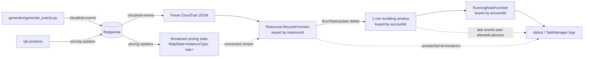

# flink-cloud-burn-rate

Real-time cloud spend rate from CloudTrail resource-lifecycle events, built on Apache Flink.

[](https://github.com/gmudumbai/flink-cloud-burn-rate/actions/workflows/ci.yml)

## The problem

AWS's official source of billing truth, the Cost and Usage Report (CUR), is
accurate but slow: it lands hours after the spend actually happened, updated
in batches. That's fine for month-end reconciliation, but useless if you
want to know *right now* whether someone just launched fifty `p4d.24xlarge`
instances by mistake.

CloudTrail, by contrast, records every `RunInstances` and `TerminateInstances`
API call within seconds of it happening. It doesn't carry the final invoiced
price, but it carries everything needed to *estimate* committed hourly spend
in real time: what was launched, when, by whom, and for which account/team.
This project treats CloudTrail as a streaming source, tracks each resource's
running/stopped lifecycle as keyed state in Flink, and maintains a live,
per-account committed hourly rate — a fast, approximate signal to sit
alongside (not replace) the slow, exact CUR.

## Architecture



## Run it

```bash
# 1. Build the job jar (throwaway Maven container -- no local JDK/Maven needed)
docker run --rm -v "$PWD":/workspace -v maven-repo:/root/.m2 -w /workspace/flink-job maven:3.9-eclipse-temurin-17 mvn -B clean package

# 2. Start the cluster, create both topics, submit the job
docker compose up -d && docker compose exec redpanda rpk topic create cloudtrail-events pricing-updates && docker compose exec jobmanager flink run -d /opt/flink/usrlib/flink-cloud-burn-rate.jar

# 3. Generate traffic
python3 -m venv .venv && source .venv/bin/activate && pip install -r generator/requirements.txt && python generator/generate_events.py --duration 150
```

## What you'll see

The Flink UI at **http://localhost:8082** (mapped off the usual 8081 to
avoid clashing with any other local Flink stack) shows the standard Flink
dashboard: 1 TaskManager with 4 slots registered, and this job's operator
DAG under Running Jobs, matching the diagram above.

`docker compose logs -f taskmanager` shows lines like:

```
account=100000000000 windowEnd=2026-09-20T00:26:00Z runningRate=$0.4324/hr
LATE: +0.3400 account=100000000000 team=platform
UNMATCHED_TERMINATION InstanceLifecycleEvent{eventName='TerminateInstances', ...}
```

## Design decisions

- **Event time, not processing time.** Every `RunInstances`/`TerminateInstances`
  carries a real `eventTime`; windows and the running total are keyed off
  that, not off when Flink happens to see the record. Otherwise the
  generator's deliberately out-of-order events would corrupt window
  boundaries based on arrival order alone.
- **Bounded out-of-orderness of 20s.** A watermark of `max event time seen -
  20s` is a latency/completeness tradeoff: tight enough that windows fire
  with reasonable freshness, loose enough to absorb realistic network/API
  jitter without marking everything late. Configurable via
  `WATERMARK_BOUND_SECONDS`.
- **Keyed state by `instanceId`.** Guarantees every `RunInstances` and its
  eventual `TerminateInstances` are processed by the same operator
  instance, so a `ValueState<RunningInstance>` can correlate them — the
  only way to know what to subtract when an instance stops.
- **24h state TTL.** Bounds state growth if a `TerminateInstances` is ever
  lost; without it, an instance whose stop event never arrives would leak
  its state entry forever.
- **Checkpointing to a filesystem path, HashMap state backend.** Every 10s,
  exactly-once, restores automatically on TaskManager failure (see
  `docs/recovery-demo.md`). HashMap is fine at this state volume; RocksDB
  is the production swap once keyed state no longer fits comfortably in
  heap, since it spills to local disk and checkpoints incrementally.
- **Broadcast state for pricing, not a periodic re-read of the JSON file.**
  Prices are small, slowly-changing reference data that needs to be joined
  against every event in a fast keyed stream — broadcast state replicates
  it identically to every parallel subtask without a stream-stream join or
  a per-record external lookup. The rate is captured at `RunInstances` time
  and reused at termination, so a live price change never makes a start
  and stop disagree.

## Recovery demo

See [`docs/recovery-demo.md`](docs/recovery-demo.md) for the full
kill-the-TaskManager-and-recover walkthrough, with real checkpoint IDs and
before/after running-rate values.

## Not here / next steps

Being specific about what this project deliberately does not attempt:

- **No reconciliation against a real CUR file.** The running rate here is
  an estimate from lifecycle events, never checked against actual billed
  amounts. A real system would periodically reconcile the two and surface
  drift.
- **No Savings Plans / Reserved Instance math.** Every rate is on-demand
  Linux pricing from a static, approximate JSON file. Real commitments
  (SPs, RIs, spot) change the effective rate per instance in ways this
  project ignores entirely.
- **EC2 only.** No EBS volumes, no data transfer, no RDS/S3/other
  services — all real, often larger, components of actual cloud spend.
- **HashMap state backend, not RocksDB.** Fine for a few hundred keys in a
  learning project; would need to switch for realistic account/fleet
  scale (see Design decisions).
- **No real sink.** Everything ends at `.print()` to stdout. A production
  version would write to a queryable store (a time-series DB, a warehouse
  table) via a transactional or idempotent sink — `.print()` itself is not
  transactional, so a recovery can reprint records already seen (see the
  exactly-once discussion in `docs/recovery-demo.md`'s surrounding notes).

---

## Appendix: phase-by-phase build notes

Working notes and deviations hit while building this incrementally,
phase by phase. Kept for anyone extending this project who wants the
detailed "what broke and why" history rather than just the polished
end state above.

### Phase 0: skeleton

Create the Kafka topic before the first submit (Flink's `KafkaSource`
describes the topic on startup, which does not trigger redpanda's
auto-create — only a produce does):

```bash
docker compose exec redpanda rpk topic create cloudtrail-events
```

Produce a one-off test message and watch it print:

```bash
docker compose exec redpanda rpk topic produce cloudtrail-events
docker compose logs taskmanager
```

### Phase 1: event generator

Streams CloudTrail-shaped `RunInstances`/`TerminateInstances` events into
the topic, with ~10% of events backdated 5-20s and ~2% backdated 60-179s
to simulate real out-of-order/late delivery.

Deviation: `kafka-python` (the plan's suggested library) does not import
on current Python (3.12+) due to an unmaintained `six` vendoring bug.
Used the drop-in community fork `kafka-python-ng` instead.

### Phase 2: keyed state and burn-rate updates

The job parses each CloudTrail event, flattens it into one record per
instance, keys by `instanceId`, and tracks running/stopped state in
`ResourceLifecycleFunction`.

Deviations hit along the way:
- **Jackson version clash at runtime.** `flink-connector-kafka`
  transitively pulls `jackson-core`/`jackson-annotations` 2.15.2, while
  our own `jackson-databind` was 2.17.2. Once shaded into one jar this
  caused a `NoSuchMethodError` at job startup. Fixed by explicitly pinning
  `jackson-core` and `jackson-annotations` to the same version as
  `jackson-databind` in `pom.xml`.
- **`mvn clean` breaks the live bind mount.** If the Flink containers are
  already running and you `mvn clean package` (which deletes and recreates
  `flink-job/target`), the `./flink-job/target` bind mount inside the
  containers goes stale — `flink run` reports the jar doesn't exist even
  though it's on the host. Fix: `docker compose restart jobmanager
  taskmanager` after any `mvn clean` while the stack is already up.

To see the `unmatchedTerminations` side output fire, cancel and resubmit
the Flink job (`flink cancel <jobId>` then `flink run -d ...`) while the
generator is still running — the fresh job has no memory of instances
started before the restart, so terminations for them are routed to
`UNMATCHED_TERMINATION` lines instead of guessing a rate to subtract.
This is a preview of why Phase 4's checkpointing matters.

### Phase 3: event time, watermarks, windows, late data

Configurable via env vars: `WATERMARK_BOUND_SECONDS` (default 20),
`ALLOWED_LATENESS_SECONDS` (default 30).

Run the generator for at least a couple of minutes (`--duration 150`) so
more than one 1-minute window actually closes. In the Flink UI, open the
job → the window/aggregate operator → its "Watermarks" tab to see
per-subtask watermarks advancing over time.

### Phase 4: checkpointing and recovery

Checkpointing every 10s, exactly-once mode, checkpoint storage on a
filesystem path (`file:///tmp/flink-checkpoints`, a named Docker volume
shared by jobmanager and taskmanager), a 5s minimum pause between
checkpoints, and a fixed-delay restart strategy (3 attempts, 5s delay).

Deviations hit along the way:
- **Checkpoint directory permission denied on first run.** The official
  Flink image runs as uid 9999 (`flink`), but a freshly created named
  Docker volume is owned by root, so the very first checkpoint attempt
  failed with `Failed to create directory for shared state: ... Operation
  not permitted`. Fixed with a one-shot `checkpoint-perms` init container
  that `chown`s the volume before jobmanager/taskmanager start. That
  container also has to bypass `docker-entrypoint.sh` entirely
  (`entrypoint: ["/bin/sh", "-c"]`) — the entrypoint always re-execs any
  command via `gosu flink` when running as root, which would silently
  undo the chown (root → flink → "Operation not permitted" again).
- `RestartStrategies` and `CheckpointingMode` (the classic
  `env.setRestartStrategy(...)` / `setCheckpointingMode(...)` APIs) are
  deprecated in 1.20 in favor of configuring restart/checkpoint behavior
  via `Configuration` keys, but they still work and are what the plan
  asked for; noted here rather than switched, since the deprecated APIs
  are simpler for a learning project and still fully functional.

See `docs/recovery-demo.md` for the full kill/recover walkthrough and
what to paste as the acceptance check.

### Phase 5 (stretch): broadcast state for live pricing updates

`PricingLookup` is no longer the only source of truth for prices.
`ResourceLifecycleFunction` is now a `KeyedBroadcastProcessFunction`: the
keyed side is still `InstanceLifecycleEvent`s by `instanceId`; the new
broadcast side is a `pricing-updates` Kafka topic carrying messages like
`{"instanceType": "m5.large", "hourlyRate": 0.5}`, replicated identically
to every parallel instance via Flink's broadcast state (`MapState<String,
Double>`).

Push a live price change:

```bash
echo '{"instanceType":"m5.large","hourlyRate":0.5}' | docker compose exec -T redpanda rpk topic produce pricing-updates
```

Deviations hit along the way:
- **Broadcast state has no ordering guarantee against the keyed side.**
  Flink does not guarantee the broadcast stream's initial values arrive
  before the first keyed element is processed. Fixed two ways: (1) the
  static `pricing/ec2-us-east-1.json` values are unioned into the
  broadcast stream itself as seed events at job start
  (`env.fromData(...)`, a bounded source that finishes after emitting —
  you'll see it show up as a "finished" task in the job overview), and
  (2) `ResourceLifecycleFunction` still keeps `PricingLookup` as a
  fallback for any instance type broadcast state doesn't have a price for
  yet, so the startup race never produces wrong output, just possibly a
  slightly stale default for the first few milliseconds.
- **Real bug caught by this phase, fixed in `ResourceLifecycleFunction`:**
  before Phase 5, `TerminateInstances` re-looked-up the current price for
  the instance's type rather than reusing the rate that was actually
  added at `RunInstances` time. That was harmless while prices were
  static, but would have silently corrupted the running total the moment
  prices could change mid-flight. `RunningInstance` now stores
  `hourlyRateAtStart`, and termination always subtracts exactly that.

### Phase 6: test, CI, README

One JUnit 5 test (`ResourceLifecycleFunctionTest`) uses Flink's
`KeyedBroadcastOperatorTestHarness` around a `CoBroadcastWithKeyedOperator`
wrapping `ResourceLifecycleFunction` directly (no mini cluster needed for
this level of test) — feeds a `RunInstances` then `TerminateInstances` for
the same instance and asserts a `+rate` then `-rate` update using the same
magnitude both times.

Deviation: the plan's suggested `MiniClusterWithClientResource` runs a full
embedded cluster and submits the whole job — overkill for testing one
function's logic in isolation, and it can't easily test a
`KeyedBroadcastProcessFunction`'s two input methods directly. Used the
lighter-weight operator test harness instead, which is the standard way
Flink's own test suite tests this exact function type. Getting the harness
working required three additional test-scope dependencies not in the
plan's stated pom: `flink-core`, `flink-streaming-java`, and
`flink-runtime` test-jars (classifier `tests`), plus
`flink-test-utils-junit` for a small utility class (`OneShotLatch`) the
harness needs internally but that isn't bundled in any of those test-jars.
